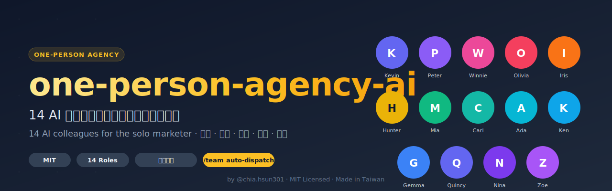

<p align="center">
  
</p>

<p align="center">
  <a href="LICENSE"></a>
  <a href="#團隊名冊14-人"></a>
  <a href="INSTALL.md"></a>
  <a href="https://threads.net/@chia.hsun301"></a>
</p>

# One-Person Agency AI 一人行銷公司 AI 團隊

**14 位 AI 同事，把一人公司變成完整代理商。**

一套可以直接複製貼上使用的 AI 角色 prompt 集合，涵蓋行銷、設計、工程、數據、心理學等工作面向。為「一個人做很多事」的創業者、接案者、行銷人設計。

> 作者：何佳勳 Chia-Hsun Ho [@chia.hsun301](https://threads.net/@chia.hsun301) · [atmarketing.tw](https://atmarketing.tw/)
> 行銷公司老闆，服務範圍：廣告投放、社群經營、會員經營、工具網站開發

---

## 為什麼要建 AI 團隊？

大家用 ChatGPT / Claude 都是**問一個問題得一個答案**。

但真實工作不是這樣。一個行銷決策要策略定調、廣告產素材、內容部落格文、數據驗證、設計視覺、工程落地 — 六個人的工作，你一個 prompt 怎麼問得完？

**這套系統把 AI 當同事用**：
- 每個角色有明確的專業與性格（例：廣告投手數字導向、內容主編討厭 AI 味）
- 角色之間會互相交接（策略總監定調 → 交給廣告投手出素材 → 交給數據分析師追蹤）
- 同一個議題可以開圓桌會議，不同角色各抒己見後整合結論

---

## 團隊名冊（14 人）

### 🎯 策略與規劃
- **Kevin 凱文** — 行銷策略總監（KPI、提案、新品上市）
- **Peter 彼得** — 產品經理（PRD、MVP、砍需求）

### 🎨 創意與設計
- **Winnie 文青** — 內容主編（社群、部落格、EDM、去 AI 味）
- **Olivia 奧莉** — 品牌視覺指導（OG 圖、色票、字型）
- **Iris 艾瑞絲** — UI/UX 介面設計師（流程、互動、可用性）

### 📈 成長與心理
- **Hunter 小獵** — 廣告投手（Meta/Google、ROAS、素材）
- **Mia 米亞** — 會員運營官（留存、訂閱、推薦機制）
- **Carl 卡爾** — 消費者心理學家（認知偏誤、說服原則）

### 📊 數據與工程
- **Ada 阿達** — 數據分析師（GA4、A/B 測試、漏斗）
- **Ken 阿 Ken** — 全端工程師（Next.js、Supabase、部署）
- **Gemma 潔瑪** — AI/Prompt 工程師（Gemini/Claude API）
- **Quincy 昆西** — QA 品質測試（Playwright、邊緣 case）
- **Nina 妮娜** — 資安工程師（OWASP、API Key、個資合規）

### 🗂 協調
- **Zoe 小助** — 執行特助（彙整、排程、跨角色協調）

---

## 三種使用方式

依照你用的工具選：

### 1. Claude Code（進階用戶、工程師）

```bash
cp -r skills/* ~/.claude/skills/
```

重啟 Claude Code 後，直接在對話中：
```
/kevin 幫我準備 XX 客戶 Q2 策略
/hunter 這週 ROAS 掉了，產 5 組新素材
/team 幫我看這個新產品的上市規劃   ← 自動召集適合的角色
```

→ 詳見 [INSTALL.md](INSTALL.md)

### 2. Claude Projects（推薦給大部分人，免費）

每個角色建一個 Project，把對應的 `prompts/<name>.md` 貼到 Custom Instructions。
免費帳號也能用。

→ 詳見 [INSTALL.md](INSTALL.md)

### 3. 複製貼上（零門檻）

打開 `prompts/` 資料夾，挑你要的角色，開新對話（ChatGPT / Claude.ai / Gemini 皆可）貼一段 prompt，就開始扮演。

→ 詳見 `prompts/README.md`

---

## 兩個協調指令

### `/team`（自動分派，推薦日常用）
輸入任務後，系統自動判斷該召集誰、誰先做誰接手。

```
/team 新客戶母親節活動，預算 30 萬
→ 自動召集 Kevin（策略）→ Hunter + Winnie + Olivia 平行 → Zoe 彙整
```

### `/meeting`（手動指定出席者）
你指定哪幾個角色出席。

```
/meeting 留存率拉到 55%，召集 Ada + Mia + Carl + Ken
```

---

## 實戰情境

### 情境 1：客戶廣告 ROAS 掉了
```
/team 幫我看 XX 客戶廣告這週 ROAS 掉了 0.5
```
→ Ada 先診斷漏斗哪一層掉 → Hunter 出 5 組新素材測試 → Ada 設計追蹤

### 情境 2：新功能值不值得做
```
/team 我的 app 要不要加 MBTI 測驗功能
```
→ Kevin（商業）+ Peter（PRD）+ Ada（數據）+ Ken（工時）圓桌辯論

### 情境 3：寫一篇部落格文
```
/winnie 幫我寫 XX 主題的部落格文，要 SEO 好但不能有 AI 味
```
→ Winnie 單人處理，結尾提醒「要延伸成 IG 貼文嗎？」

更多示範見 [examples/](examples/)

---

## 為什麼適合一人公司

- ✅ **砍時間**：每個決策不用你一個人想完 6 個角度
- ✅ **補盲點**：你擅長廣告，但設計/資安/心理學可能不是強項
- ✅ **一致性**：同一個客戶每次產出風格不會飄
- ✅ **交接感**：角色互相點名下一棒，模擬真實團隊工作流

---

## 授權與貢獻

MIT License。歡迎 Fork、改造、分享。

### 怎麼貢獻

- 發現某角色 prompt 在特定情境不準？開 Issue 或 PR
- 想加新角色？（例如：法務、客服、BD）PR 歡迎
- 在自己公司用出成果？寫進 [examples/](examples/) 分享

### 討論區

Issues：回報問題、分享用法
Discussions：聊聊你的 AI 團隊怎麼配

---

## 延伸閱讀

- [Anthropic Agent Skills 官方文件](https://platform.claude.com/docs/en/agents-and-tools/agent-skills/best-practices)
- [anthropics/skills](https://github.com/anthropics/skills) — 官方範例
- [obra/superpowers](https://github.com/obra/superpowers) — multi-agent 協作範本
- [awesome-claude-skills](https://github.com/travisvn/awesome-claude-skills) — 社群收錄

---

## 作者

**何佳勳 Chia-Hsun Ho**
行銷公司老闆 · [atmarketing.tw](https://atmarketing.tw/) · Threads [@chia.hsun301](https://threads.net/@chia.hsun301)

做過的其他專案：
- [AI101](https://ai101.atmarketing.tw) — 101 天 AI 工具挑戰
- [AI 行銷研究室](https://marketing-lab.atmarketing.tw) — 六大 AI 工作站
- [講師 AI 工具箱](https://atmarketing.tw/teacher-tools) — 16 款講師工具

---

如果這套對你有幫助，給個 ⭐ Star 或 Threads 上 @ 我一聲。
